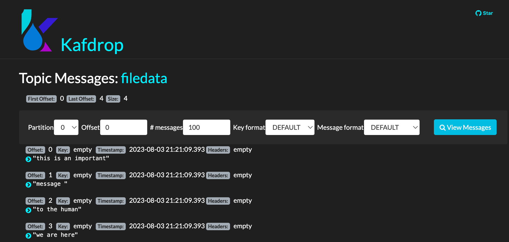

# A simple file source to topic to file demo

Created 8/2023. Update 09/2024: Move to Kafka 3.8.0

The source connector is reading a text file and send a message to kafka for each line, adding a time stamp to each record.

## File Source to Topic to File Sink

The docker compose uses a Kafka connect standalone mode. It declares one broker, one zookeeper, creates a topic using kafka script, and uses Kafdrop as a user interface.

The created topic is filedata

```
/opt/kafka/bin/kafka-topics.sh --bootstrap-server kafka:29092 --create  --if-not-exists --replication-factor 1 --partitions 1 --topic filedata" 
```

For a kconnect connector: the container mounts the local folder to /home/kafka/kconnect, and starts the connect-standalone script:

```sh
"bin/connect-standalone.sh /home/kafka/kconnect/connect-standalone.properties /home/kafka/kconnect/source-connector.properties /home/kafka/kconnect/sink-connector.properties"
```

The container needs to also mount a logs folder to get the logs, to avoid an exception within the Kafka connect container.

Both connector configuration has a new attribute to specify the type of connector.

```properties
name=local-file-source
connector.class=FileStreamSource
type=source
tasks.max=1
topic=filedata
file=/home/kafka/kconnect/test.txt
```

The source connector keeps a row index from the source file, so modifying an existing row will not add a new message to the topic. 

The sink connector

```properties
name=local-file-sink
connector.class=FileStreamSinkConnector
type=sink
tasks.max=1
file=/home/kafka/kconnect/test.sink.txt
topics=filedata
```

## Demonstration

* Start the kafka cluster with a Kconnect cluster using `docker compose up -d`
* Connect to Kafrop to at [http://localhost:9000](http://localhost:9000), and look at messages within the `filedata` topic

    

    The source connector has worked !.

* The sink connector has written to a new file.
* Adding more lines to `test.txt` input file, we can observe, the source connector detects those changes automatically. We only have to make sure to insert new lines at the end of the file, otherwise, the source connector won't consider any update.
* Also deleting the sink file, and adding new lines into the source file, will only give the delta.
